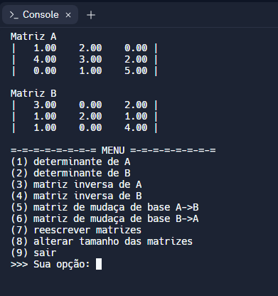

# Matrizes - Álgebra Linear
Trabalho sobre Matrizes que compõe a nota da 1ª etapa da disciplina de Álgebra Linear

## O que o programa faz
- Recebe um tamanho de matriz NxN
- Recebe duas matrizes A e B
- Calcula o determinante
- Calcula a matriz inversa
- Calcula a matriz de mudança de base

## Requisitos
- Editor de código (Recomendações: [Replit](https://replit.com) ou [Visual Studio Code](https://code.visualstudio.com))
- Para replit: conta é necessária
- Para VSCode (Windows): compilador GCC é necessário

## Modo de uso
### Replit
1) Criar conta
2) Criar repl com "Linguagem C" marcada
3) Fazer upload do arquivo <code>main.c</code>
4) Digitar no console <code>gcc -o main.e main.c -lm</code> para compilar o arquivo
5) Digitar no console <code>./main.e</code> para executar o arquivo

### Visual Studio Code
1) Instalar VSCode ou utilizar VSCode Web
2) Instalar Compilador GCC
3) Fazer upload do arquivo <code>main.c</code>
4) Abrir novo terminal
5) Digitar no terminal <code>gcc main.c -o main</code> para compilar arquivo
6) Digitar no terminal <code>./main</code> para executar o arquivo

## Contribuidores
- Chrislan Machado
- Elias de Almeida
- Marcos Kaique
- Rai Ferreira

## Licença
[MIT License](https://choosealicense.com/licenses/mit/)
